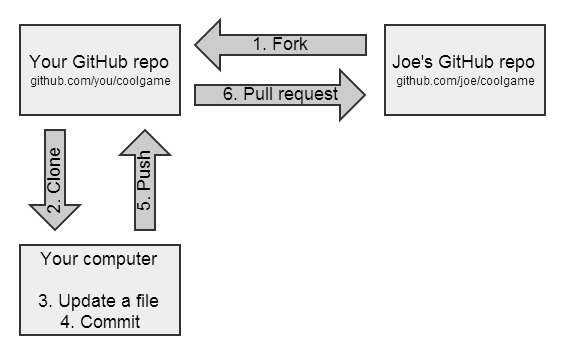

# git常用命令整理

- [git常用命令整理](#git常用命令整理)
- [拉取最新的代码](#拉取最新的代码)
- [git submodule](#git-submodule)
- [fork项目管理](#fork项目管理)
- [pull代码冲突](#pull代码冲突)
- [合并多次commit](#合并多次commit)
- [更新.gitignore](#更新gitignore)
- [git rm](#git-rm)
- [生成和应用patch](#生成和应用patch)

🏷`工作区、暂存库、版本库`


🏷`Fork 工作流程`



```bash

# 常用指令
git clone # 拉取代码
git branch # -a 查询所有分支 -d 删除分支
git status # 显示所有文件的状态（tracked, staged)
git diff 分支名 # 两个分支的区别
git diff # 比较工作区和暂存区文件区别，不包含新添加untracked的文件
git checkout # 切换/新建分支
git push -u origin master # 推送代码
# 设置用户名和邮箱
git config --global user.name "YourName"
git config --global user.email "email@mail.com"

ssh-keygen -t rsa -f ~/.ssh/gitlab-rsa -C "jiahuil@nvidia.com" # 生成新的ssh key
git remote set-url origin https://git-repo/new-repository.git

# 推送代码
git add .
git commit -m "commit"
git push orgin master

# 拉取远程分支
git fetch
git branch -a 
git checkout -b 本地分支名 origin/远程分支名

# 拉取远程tag（查看代码）
git fetch
git tag
git checkout -b [new-branch-name] [tag-name]

# 撤回上一次commit
git reset HEAD^

# 撤回多次之前的commit
git reflog # 查询HEAD
git reset [HEAD] # 回退
```

## 拉取最新的代码

```
# pull 自动合并
git pull
# fetch+merge 手动合并
git remote -v # 查看远程仓库
git fetch origin master:temp # 从远程的origin仓库的master分支下载到本地并新建一个temp分支
git diff temp # 查看temp分支与本地原有分支的不同
git merge temp # 合并
git branch -d temp # 删除分支
git push origin --delete temp # 删除远程分支
```

## git submodule

```
# ref: https://zhuanlan.zhihu.com/p/87053283
# https://www.cnblogs.com/jyroy/p/14367776.html
# 将一个git repo作为另一个git repo的子目录
#添加submodule
git submodule add <submodule_url> <submodule_path>
# 初始化主项目的子项目
git submodule init
git submodule update
# 删除
git submodule deinit project-sub-1
git rm project-sub-1
vim .git/config
rm -rf .git/modules/子模块目录
```

## fork项目管理

```bash
# 添加源项目
git remote add upstream git@xxxxxxx.git
git fetch -t upstream
git fetch -t upstream

# 切换源项目的branch/tag
git checkout {tag}
git checkout -b {branch_name} upstream/{branch}
```

## pull代码冲突

```bash
# error
Auto Merge Failed; Fix Conflicts and Then Commit the Result.
# method 1: give up local branch
git reset --hard origin/master
# method 2: metain the local branch
git add .
git commmit -m "commit"
# method 3: give up the pull, back to the last commit
git reset --hard HEAD
```

## 合并多次commit

```bash
# 查看commit历史
git log --oneline
# 修改commit
git rebase -i # 显示全部commit
git rebase -i <commit_sha> # 显示commit_sha后的所有commit
git rebase -i HEAD~4 # HEAD之前三个版本
# 修改完成后，要在push到远程之前进行rebase，push到远程之后就不要rebase了
git push --force origin main
# 合并多次commit可能出现conflict
# 选择接受哪次commit
git add .
git rebase --continue
git push --force origin main
```

## 更新.gitignore

```bash
# .gitignore只能忽略 untracked 的文件，如果已经tracked，就需要删除本地缓存
git rm --cached <folder>
git add .
git commit -m "update .gitignore"
```

## git rm

```bash
# 删除暂存区和工作区
git rm <file>
# 删除暂存区，保留本地文件
git rm --cached <file>
```

## 生成和应用patch

```bash
# git diff > xxx.patch
git diff test.py > test.patch
git diff > test.patch

# git format-patch
$ git format-patch HEAD^       #生成最近的1次commit的patch
$ git format-patch HEAD^^      #生成最近的2次commit的patch
$ git format-patch <r1>..<r2>  #生成两个commit间的修改的patch（生成的patch不包含r1. <r1>和<r2>都是具体的commit号)
$ git format-patch -1 <r1>     #生成单个commit的patch
$ git format-patch <r1>        #生成某commit以来的修改patch
$ git format-patch --root <r1> #生成从根到r1提交的所有patch
```

git am会直接将patch的所有信息打上去，而且不用重新git add和git commit，author也是patch的author而不是打patch的人。

git apply：打完patch后需要重新git add和git commit。
检查patch的情况

```bash
git apply --stat 0001-limit-log-function.patch  # 查看patch的情况
git apply --check 0001-limit-log-function.patch # 检查patch是否能够打上，如果没有任何输出，则说明无冲突，可以打上

# 打patch场景之一使用git diff生成的patch
git apply xxx.patch 
#打patch场景之二使用git format-patch生成的patch
git am 0001-limit-log-function.patch     # 将patch打上
git am ~/patch-set/*.patch  #将路径~/patch-set/*.patch 按照先后顺序打上
git am --abort  #当git am失败时，返回没有打patch的状态)
git am --resolved #当git am失败，解决完冲突后，这条命令会接着打patch
```
